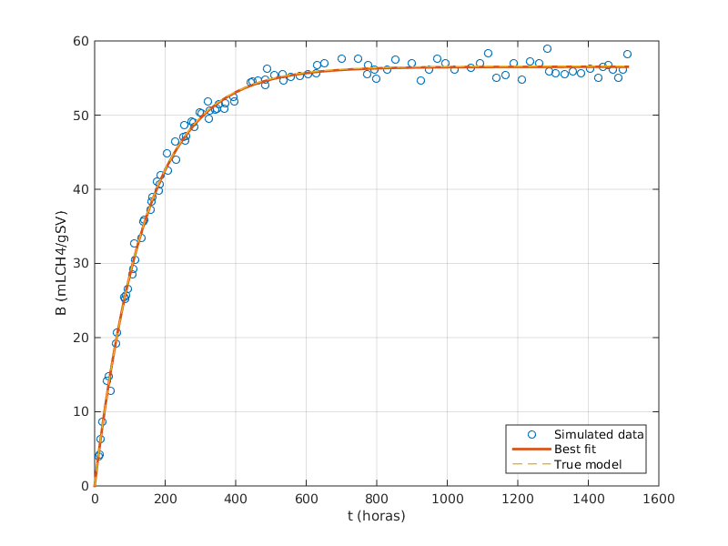
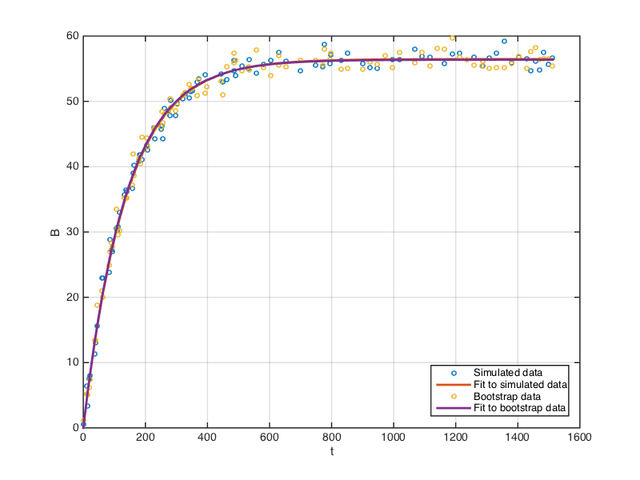
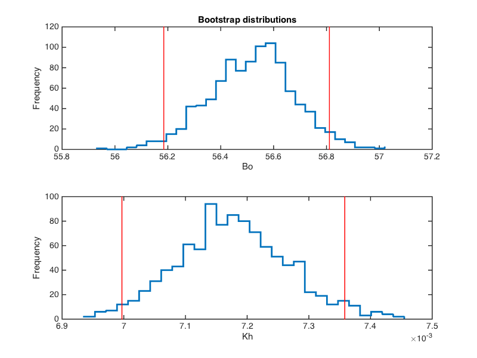
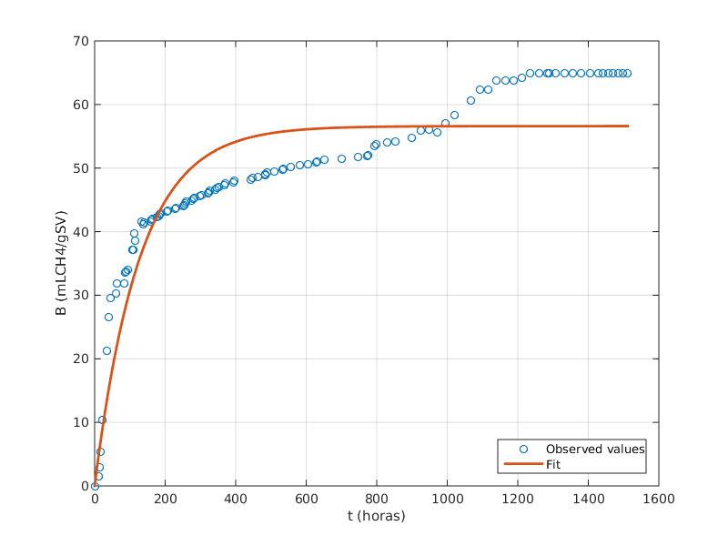
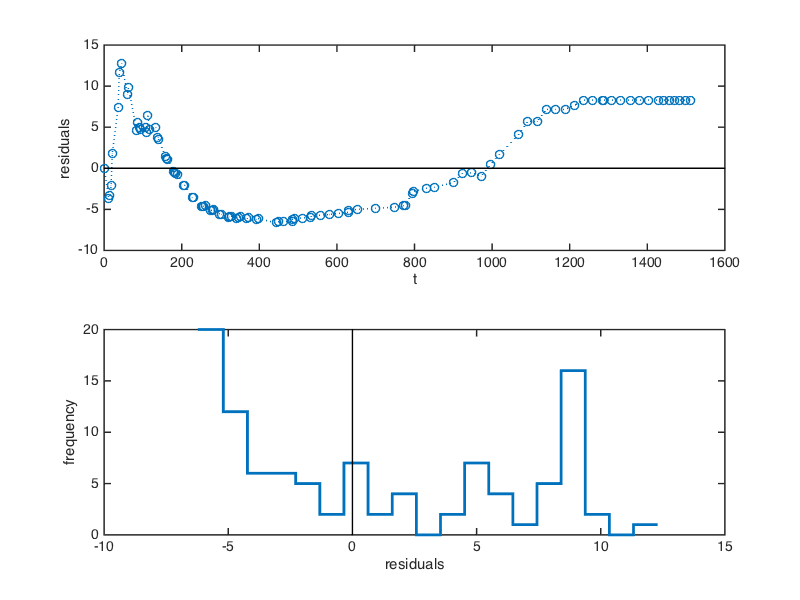
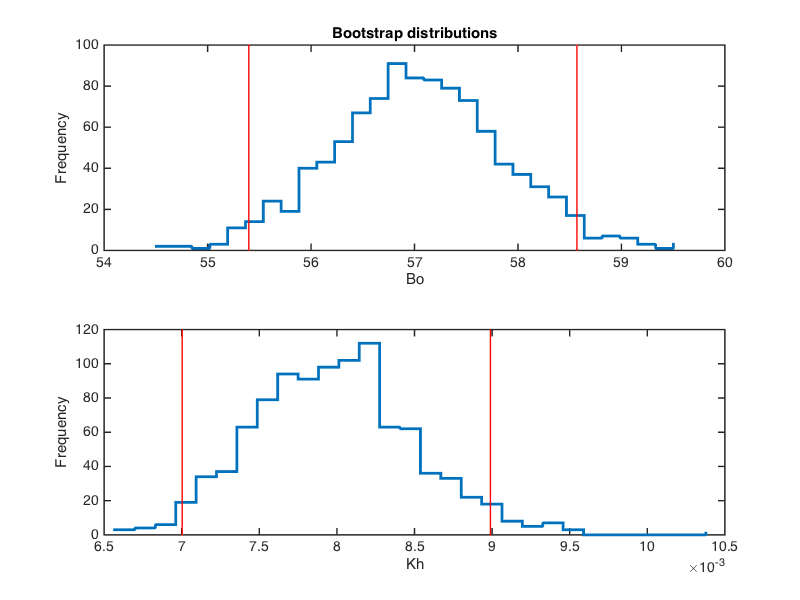
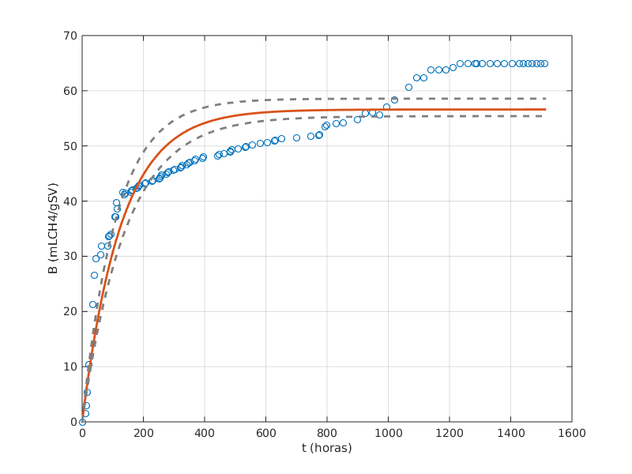

This document shows the application of bootstrap to a nonlinear regression problem using Matlab

## Part 1: Bootstrap demo with simulated data

To demonstrate the bootstrap procedure, we will first simulate some noisy data from the model:

B(t) = Bo\*(1 - exp(-Kh\*t))

with two parameters: Bo, the maximum value of B, and Kh, the rate constant for the process. The [following function](Hidrolisis.m) computes the model output B(t) for input parameter values and a vector of time points:
```matlab
%Modelo de la cinética de primer orden 
function B= Hidrolisis(Var, t) %Var representas las variables del modelo
Bo=Var(1);
Kh=Var(2);
B= Bo*(1-exp(-Kh*t));
end
```

### Simulate data

To simulate experimental data, we will add some normally distributed noise to the model prediction
```matlab
% Load time points
t=xlsread('PBM.xlsx','A2:A104');
% Specify model parameters
Bo = 56.60; %mLCH4/gSV
Kh = 0.007;       %h^1
modelVar = [Bo Kh];
% Compute model prediction
Breal = Hidrolisis(modelVar, t);
%Adicionar error normal o "ruido" a la simualación de los experimentos
% Add noise to model prediction
NoiseStd = 1; % La desviación estándar (sd of noise)
err = NoiseStd*randn(length(Breal), 1);
Bexp = Breal + err; % This is simulated noisy data that we will fit
```

### Fit simulated data

We then fit the noisy data to our model using nonlinear regression. In the following code block, we call the  Matlab function `nlinfit` with some reasonable initial guesses for the two model parameters:
```matlab
% Perform nonlinear regression on simulated data
options=statset('Display', 'iter');
% Initialize with reasonable parameter guesses
betaGuess = [max(Bexp) 0.1]; %Valores iniiciales 
% Extract best fit parameters and residuals 
[betaHat, residuals, ~, ~, ~] = nlinfit(t, Bexp, @Hidrolisis, betaGuess, options);
betaHat 

% Output:
% betaHat =
%
%   56.4760    0.0072
```

Note: the syntax `[betaHat, residuals, ~, ~, ~] = nlinfit(...)` collects the first two outputs (`betaHat` and `residuals`) and ignores the remaining outputs from the function call to `nlinfit()`. This is a useful little trick if we don't want to clutter our Matlab workspace with variables that will not be used. 

The following plot shows the data and the fit together (see [complete code](bootstrap-demo.m) for the code block that generates this figure). The fitted curve almost entirely overlaps with the true model, as is to be expected given how well the parameter estimates (`betaHat`) converge to the true parameter values (`modelVar`).



### Bootstrap estimation of uncertainty

Next we use a bootstrap procedure to estimate the uncertainty in `betaHat`. A single application of the bootstrap algorithm consists of the following steps:

1. Resample the residuals with replacement.
2. Add resampled residuals to the fitted model to generate a bootstrap dataset. 
3. Fit the bootstap dataset and extract the estimated parameters.

The next code block demonstrates these steps:

``` matlab
% Bootstrap example: Generate a single bootrap dataset and fit 
% Resample residuals
[~, bootIndices] = bootstrp(1, [], residuals);
bootResiduals = residuals(bootIndices);
% Add resampled residuals to model prediction
Bmodel = Hidrolisis(betaHat, t); % Model prediction using estimated parameters
Bbootstrap = Bmodel + bootResiduals;
% Fit bootstrap data  
betaBoot = nlinfit(t, Bbootstrap, @Hidrolisis, betaGuess);
betaBoot

% Output
% betaBoot =
%
%   56.3776    0.0073

```

Notes on the code:
- The function call `[~, bootIndices] = bootstrp(1, [], residuals);` returns a list of indices obtained by resampling with replacement from the vector `1:length(residuals)`.  
- To resample residuals, we select the residuals at these indices using `bootResiduals = residuals(bootIndices);`. 
- We then add the resampled residuals to the model prediction to generate the boostrap dataset `Bbootstrap`.
- Finally, we fit the bootstrap dataset using a call to `nlinfit()`. 

The following plot shows the original data we first simulated, and the bootstrap data generated as above, together with the fits to each dataset. 



In practice, the bootstrap procedure is repeated many times - typically a few hundred to a few thousand times - to generate a **bootstrap distribution** of the estimated parameters. The next code block uses a `for` loop to accomplish this:

```matlab
% Now, apply bootstrap procedure many times to build up the bootstrap distributions 
nboot= 1000; %Número de replicas para el Bootstrap
[~, bootIndices] = bootstrp(nboot, [], residuals);
bootResiduals = residuals(bootIndices);
Bbootstrap =repmat(Bmodel, 1, nboot) + bootResiduals;
% Fit each bootstrap datset and extract parameter estimates
betaBoot=zeros(nboot,2);
for i=1:nboot
    betaBoot(i,:)=nlinfit(t, Bbootstrap(:,i), @Hidrolisis, betaGuess);
end
```

This time, each column of `bootIndices` is an independent resampling with replacement from the vector `1:length(residuals)`. We then use these indices to resample the residuals. Therefore, each column of `bootResiduals` is a set of bootstrap residuals. As before, we add these residuals to the model prediction to generate bootstrap datasets. Thus, each column of `Bbootstrap` is a single bootstrap dataset. We fit these bootstrap datasets to our model and collect the parameter estimates in the matrix `betaBoot`. These estimates make up the bootstrap distributions of the two parameters plotted below. The vertical red lines show the 95% confidence interval for each parameter.



The confidence intervals are computed using percentiles:
``` matlab
% Estimate bootstrap confidence intervals
%Estimación del Intervalo de Confianza del 95%
bootCI = prctile(betaBoot, [2.5 97.5]);

% Output
% bootCI =
%
%   56.1847    0.0070
%   56.8111    0.0074
```

## Part 2: Bootstrap application to observed data

Now, we will apply the bootstrap procedure to some observed data. We begin by loading the observed response `Bensayo`, and fitting these to our model
``` matlab
% Load observed values
Bensayo=xlsread('PBM.xlsx','B2:B104');
% Fit to model
betaGuess = [max(Bensayo), 0.1]
[betaHat, residuals, ~, ~, ~] = nlinfit(t, Bensayo, @Hidrolisis, betaGuess, options);
betaHat
%
% Output
% betaHat =
%
%   56.6050    0.0078
```

Plot data and the fit:



Notice that the single exponential model does not fit the observed data as well as it fit the simulated data. This is also apparent in the plots of the residuals below, as well as the distribution of residuals, which is very *non-normal*. When the data are well described by a model, we expect the residuals to be distributed randomly above and below zero.  



These observations suggest that the single exponential model might not be the best descriptor of these data. With this caveat, we now proceed with the bootstrap procedure as before:

``` matlab
% Apply bootstrap procedure to observed data
nboot= 1000; %Número de replicas para el Bootstrap
[~, bootIndices] = bootstrp(nboot, [], residuals);
bootResiduals = residuals(bootIndices);
Bmodel = Hidrolisis(betaHat, t);
Bbootstrap =repmat(Bmodel, 1, nboot) + bootResiduals;
% Fit each bootstrap datset and extract parameter estimates
betaBoot=zeros(nboot,2);
for i=1:nboot
    betaBoot(i,:)=nlinfit(t, Bbootstrap(:,i), @Hidrolisis, betaGuess);
end

% Estimate 95% bootstrap confidence intervals
bootCI = prctile(betaBoot, [2.5 97.5])

% Output
% bootCI =
% 
%   55.3984    0.0070
%   58.5698    0.0090
```

The following plots show the bootstrap distributions and 95% confidence intervals for each parameter. 



Finally, we use the parameter confidence intervals to generate a prediction envelope for the model (shown below in dashed gray lines) with the following code block:
``` matlab
% Plot data, model and bootstrap prediction intervals
clf()
plot(t, Bensayo, 'o', 'MarkerSize', 6) % Plot data
hold on
tplot = linspace(0, max(t), 200);
Bplot = Hidrolisis(betaHat, tplot);
plot(tplot, Bplot,'-','LineWidth', 2) % Add best fit curve
Blo = Hidrolisis(bootCI(1,:), tplot); % Bootstrap  lower bound
plot(tplot, Blo, '--', 'LineWidth', 2, 'Color', [0.5 0.5 0.5])
Bhi = Hidrolisis(bootCI(2,:), tplot); % Bootstrap upper bound
plot(tplot, Bhi, '--', 'LineWidth', 2, 'Color', [0.5 0.5 0.5])
xlabel('t (horas)')
ylabel('B (mLCH4/gSV)')
grid on
hold off
```



---

[Click here](bootstrap-demo.m) for the complete code in one place.
